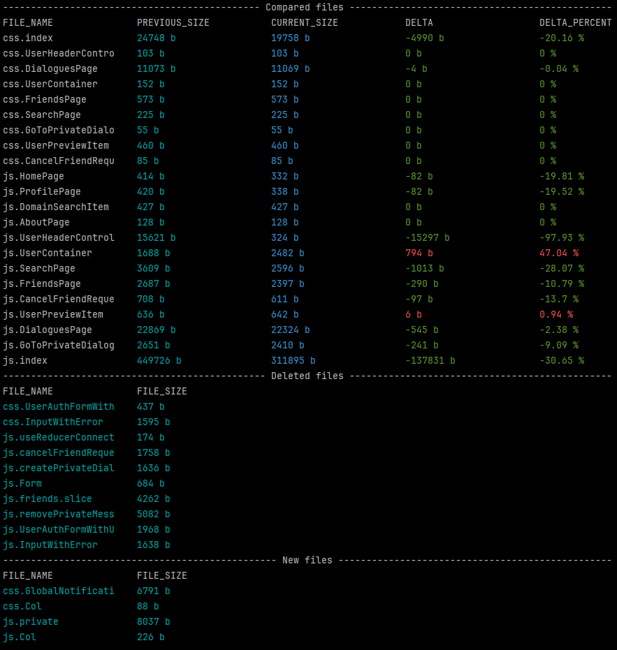

# vite-plugin-bundle-monitoring

```npm
npm i -D vite-plugin-bundle-monitoring
```

Plugin for vite to monitor changes in bundle size.

Executed after the build is complete and compares the current files with the previous ones.


## Get start

To use, you just need to add it to plugins in Vite config

```typescript
import VitePluginBundleMonitoring from 'vite-plugin-bundle-monitoring';


export default defineConfig({
    plugins: [
        VitePluginBundleMonitoring({
            compareFileDir: path.resolve(__dirname, 'compare'),
        }),
    ],
})
```

If you want the size to be calculated from new data, simply delete or move the old data to another location.

## PluginOptions

```typescript
type VitePluginBundleMonitoringOptions = {
    compareFileDir?: string;   // default: __dirname
    compareFileName?: string;  // default: vite-bundle-monitoring.compare.json
}
```
